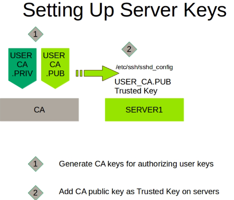
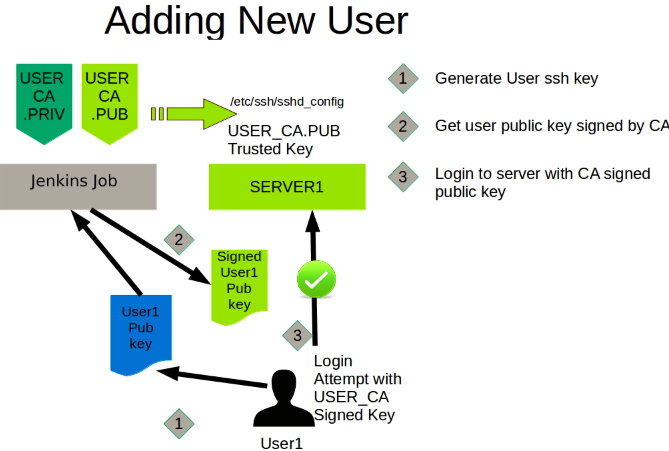

Ansible role: certificateSSH
=========

This role is designed to Deploy certificate-based SSH with Ansible. to implement parts of the architecture described by Facebook's Engineering Blog post: [Scalable and secure access with SSH by Marlon Dutra](https://engineering.fb.com/production-engineering/scalable-and-secure-access-with-ssh/)

Servers Certificate Configuration
------------

The following Tasks, in order of execution, are implemented.
1. Common: implemented by all hosts, as correct timing is necessary for a certificate-based system and Ensure that openssh server is installed and started.
2. automationServer: implemented by the Ansible server (localhost), to performs some initial prep work to store the CA public key in temporary directory.
3. CAServer: implemented by the Certificate Authority, this role performs the initial setup of a CA.
4. sshServers: implemented by all hosts that end-users will log into, this role configures the hosts to trust the CA and the appropriate principals

Signing user keys
------------

1. ssh user public key transferred to Jenkins job to be signed with CA Private Key
2. User ssh public key signed by CA Private Key
3. ssh key transferred back to client after signing with CA Private Key

Role Variables
--------------
Available variables are listed below, along with default values (see [defaults/main.yml](defaults/main.yml)):

Path to the temporary ansible directory created on the ansible host. This directory is used for storage of downloaded CA public keys.

    ansible_temp_directory: /var/ansible_ssh

Path to store the CA public/private key pair in the certificateAuthority host.

    ca_user_dir: /etc/ssh/ca_user_key

Path to principals file used to control access to any local user by creating those files under /etc/ssh/auth_principals.

    authorized_principals_dir: /etc/ssh/auth_principals

A SSH User Certificate Authority can sign and thus securely authenticate each client connecting to a server.
The signed certificate also designates the principals (login identities) that can be used with that certificate. For each user, the principals can be described on a file:

    echo -e 'access-root' > /etc/ssh/auth_principals/root
    echo -e 'access-databases' > /etc/ssh/auth_principals/foobar

In this example, any signed certificate with the access-root principal would be allowed to SSH into that host with the root username, and any signed certificate with the access-databases principal would be able to login with the foobar user.

key revocation list any public key authentication in this list will be refused for all users.

    revoke_keys_file: /etc/ssh/revoked_keys

To use
----------------
see [SSH Certificates for Authenticating Users](README-User.md)

To revoke keys
--------------
Keys can be revoked by adding them to the revoked_keys file

    ssh-keygen -k -f /etc/ssh/revoked_keys $public_key_to_revoke
    ssh-keygen -k -u -f /etc/ssh/revoked_keys $additional_public_keys_to_revoke

Example Playbook
----------------

    - hosts: servers
      roles:
         - certificateSSH
